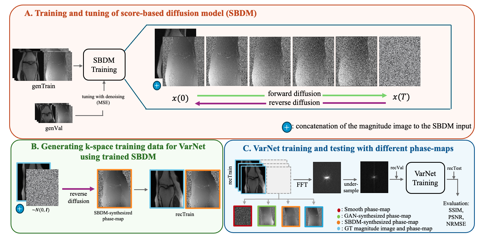

# Phase-map synthesis from magnitude-only MR images using conditional score-based diffusion models with application in training of accelerated MRI reconstruction models

PyTorch implementation of **phase-map synthesis with SBDM**.

## Credits 
* SBDM architecture & training code is modified from [DiffusionMBIR](https://github.com/HJ-harry/DiffusionMBIR.git).
* Pix2pix GAN architecture & training code is modified from [CycleGAN-pix2pix](https://github.com/junyanz/pytorch-CycleGAN-and-pix2pix.git).
* VarNet architecture & training code is modified from [fastMRI](https://github.com/facebookresearch/fastMRI.git).
